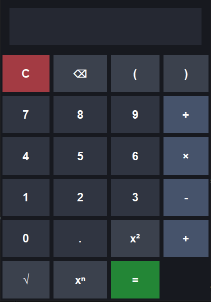

# Python Calculator 🧮

My first Python project (Calculator), built using Tkinter.


## Screenshot



## Features

* Addition, subtraction, multiplication, and division
* Square roots and powers
* Dark-themed graphical interface
* Error handling
* Keyboard shortcuts

## Technologies Used

* Python
* Tkinter
* ast
* math
* operator

## How to Run


1. Install Python.
2. Download `calculator.py`.
3. Run the file using:

   ```bash
   python calculator.py
   ```

Enjoy
